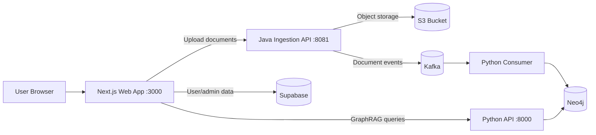

# PolicyMe

<p align="center">
  
  
  
  
  
  
  
</p>

PolicyMe is a multi-service insurance intelligence platform that combines document ingestion, AI-assisted policy analysis, and operational dashboards.

It is built as a monorepo with three production-facing services:

- A Next.js app for customer, adjuster, underwriter, manager, and admin workflows.
- A Java ingestion API for upload, extraction, and Kafka publishing.
- A Python GraphRAG engine for semantic retrieval and graph-powered AI responses.

## Table of contents

- [Why PolicyMe](#why-policyme)
- [System architecture](#system-architecture)
- [Repository layout](#repository-layout)
- [Quick start](#quick-start)
- [Service APIs](#service-apis)
- [Troubleshooting](#troubleshooting)
- [Contributing](#contributing)
- [License](#license)

## Why PolicyMe

PolicyMe is optimized for teams that need explainable, auditable insurance workflows:

- Upload policy/claim documents through a structured ingestion path.
- Extract and enrich document content into graph-friendly units.
- Query policy context through GraphRAG with citations.
- Run role-based operational dashboards with demo and live data modes.

## System architecture



## Repository layout

```text
Policyme/
|-- docs/                         # Product and implementation docs
|-- policyme/                     # Next.js frontend + API routes
|-- policyme-java-ingestion/      # Spring Boot ingestion service + compose
|-- policyme-graphrag-engine/     # FastAPI + Kafka consumer + Neo4j logic
|-- LICENSE
`-- README.md
```

## Quick start

### Prerequisites

- Node.js 20.x and npm 10+
- Java 17 and Maven 3.9+
- Python 3.11+ (Docker path uses Python 3.12)
- Docker and Docker Compose

### Option A: Run core backend stack with Docker Compose

From the repository root:

```bash
cd policyme-java-ingestion
docker compose up --build
```

This brings up:

- Zookeeper (2181)
- Kafka (9092 / 29092)
- Neo4j (7474 / 7687)
- GraphRAG API (8000)
- GraphRAG Kafka consumer
- Ingestion API (8081)

Then start the web app separately:

```bash
cd ../policyme
npm install
npm run dev
```

### Option B: Run services individually

1) Infrastructure only:

```bash
cd policyme-java-ingestion
docker compose up -d zookeeper kafka neo4j
```

2) Ingestion API:

```bash
cd policyme-java-ingestion
mvn spring-boot:run
```

3) GraphRAG API:

```bash
cd policyme-graphrag-engine
pip install -r requirements.txt
python main.py
```

4) GraphRAG consumer:

```bash
cd policyme-graphrag-engine
python kafka_consumer.py
```

5) Frontend:

```bash
cd policyme
npm install
npm run dev
```

## Service APIs

### Java ingestion API (:8081)

- POST /api/documents/upload
- GET /api/documents/health

### Python GraphRAG API (:8000)

- POST /graphrag/query
- GET /graphrag/macro_graph
- POST /api/voice-claim
- POST /api/underwrite
- GET /health

### Next.js app (:3000)

- Role-based dashboards and customer portal
- API routes under /api/* for app-side orchestration

## Troubleshooting

### Demo accounts are not visible

Enable demo mode in your deployment configuration and redeploy.

### NextAuth NO_SECRET in production logs

Set a valid authentication secret in production configuration.

### Demo login shows server configuration error

Verify all of the following:

- The live public base URL is configured correctly.
- Authentication secret is present in production.
- The auth providers endpoint returns valid JSON and includes credentials in demo mode.

### Linux build says module not found for src/lib paths

Ensure src/lib files are tracked in git and not excluded by root-level ignore rules.

## Contributing

Contributions are welcome.

Recommended process:

1. Create a feature branch.
2. Keep changes scoped per service where possible.
3. Run checks before PR:

```bash
cd policyme
npm run lint
npm run build
```

4. Open a PR with clear context, testing notes, and screenshots for UI changes.

## License

Licensed under MIT. See [LICENSE](LICENSE).
